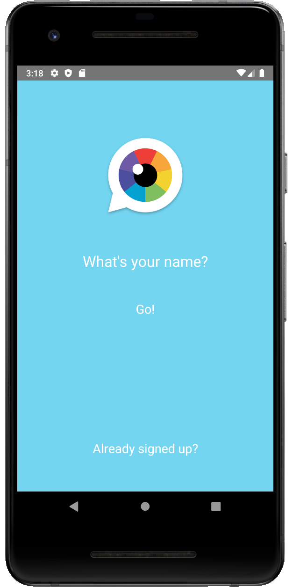
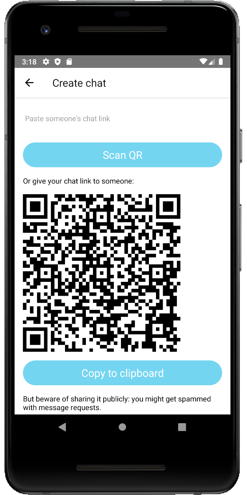
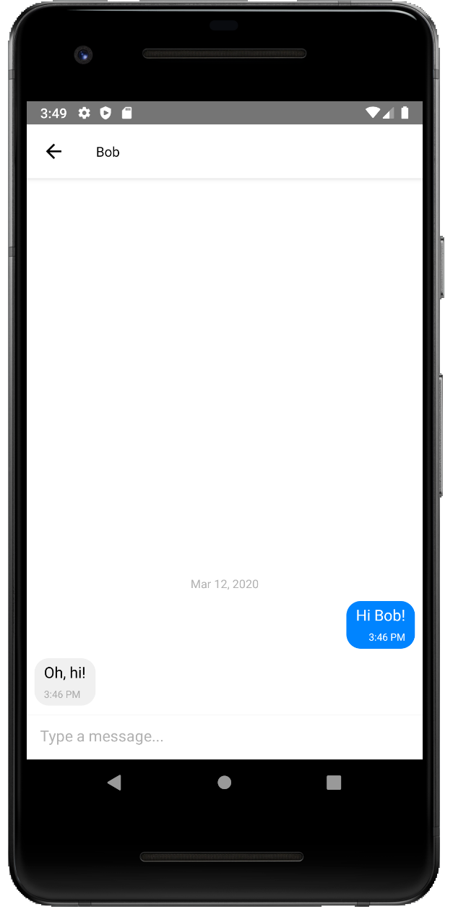

12 March 2020:

Basic features are working, but it's unusably slow. Using native crypto for SEA could be a solution.

Play Store Beta release:
https://play.google.com/apps/testing/to.iris.Iris

APK:https://github.com/irislib/iris-mobile/releases

Testflight pending

